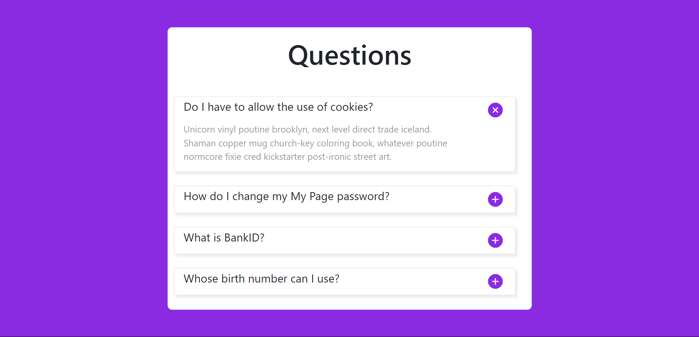

# Project Title

Just A simple Task .

## Table of Contents

- [Project Overview](#project-overview)
- [Features](#features)
- [Technologies Used](#technologies-used)
- [Screenshot](#screenshot)

## Project Overview

Task that show you can make question like an exam.

## Features

- Feature 1: Whe you click on + you show more letters.

## Technologies Used

- React: For building the user interface.
- Bootstrap: For styling the UI.

## Screenshot 

